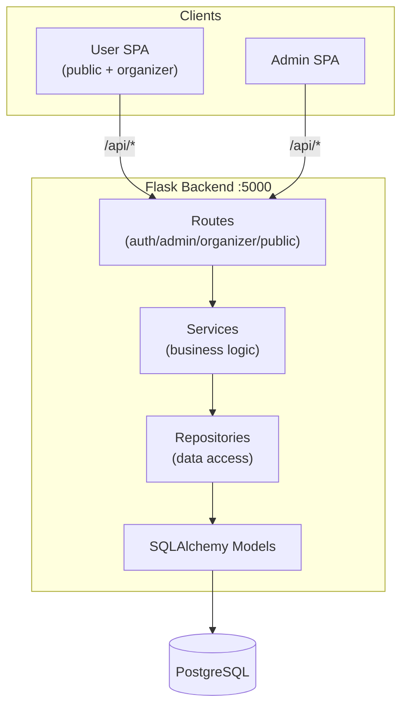
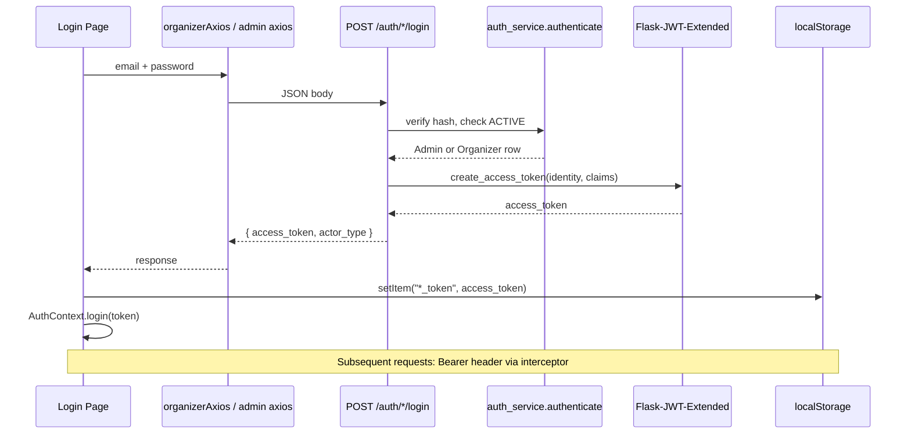
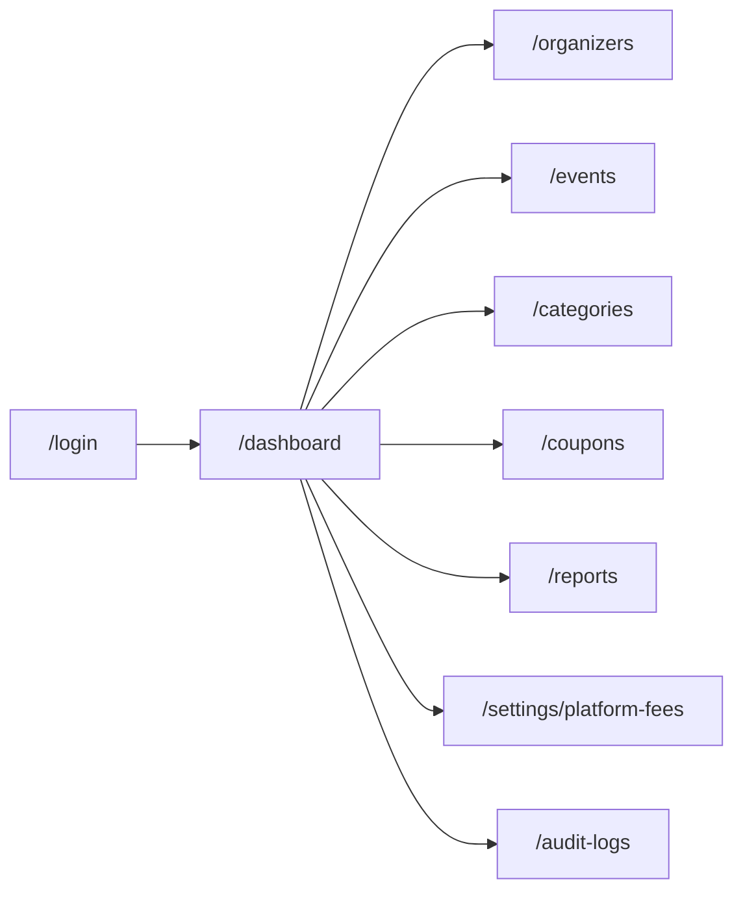
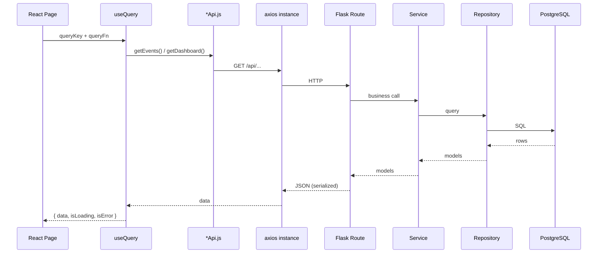
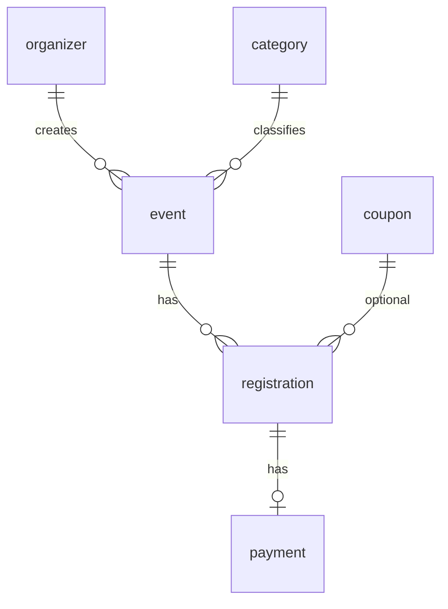
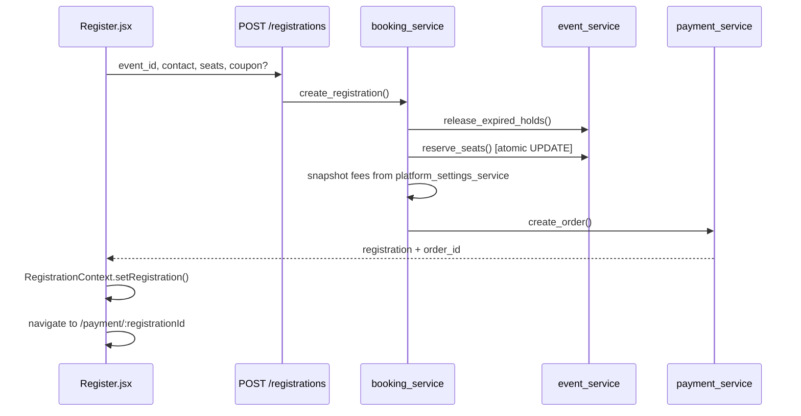
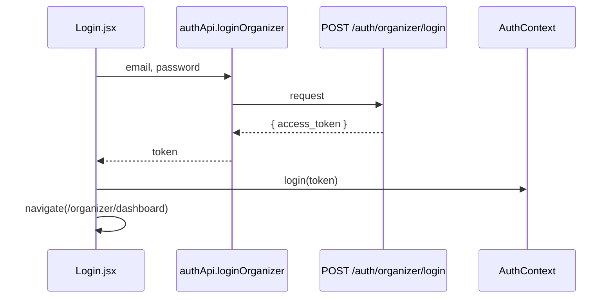
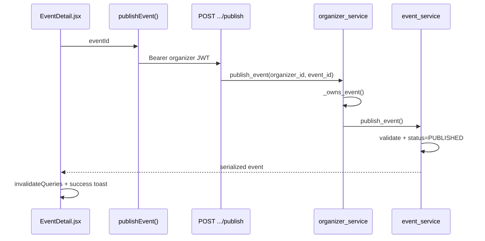
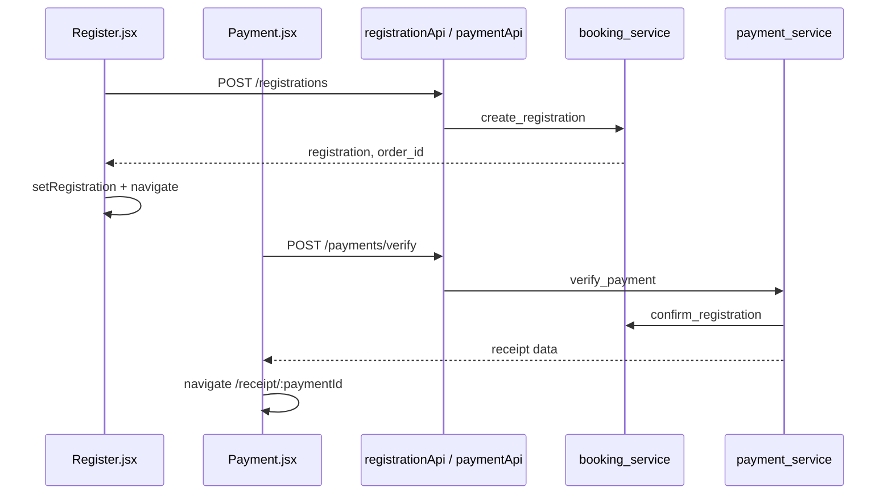
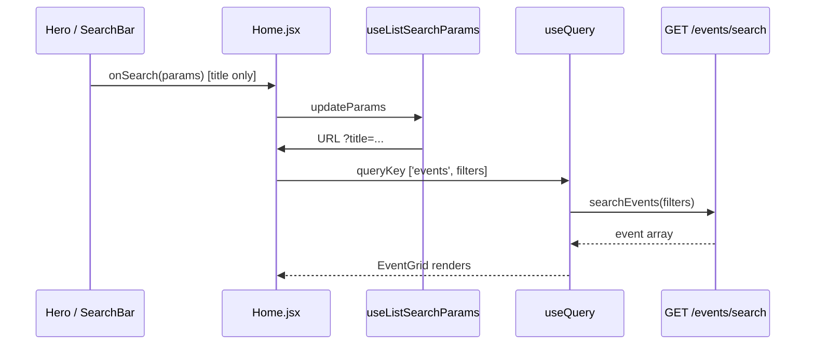

# Event Management Platform — Project Architecture Guide

> **Audience:** Developers onboarding to, maintaining, or interviewing about this codebase.  
> **Scope:** Full-stack implementation details for `E:\event_mgmt_v0` — not generic textbook explanations.

---

## Table of Contents

1. [Project Overview](#1-project-overview)
2. [Authentication](#2-authentication)
3. [Authorization](#3-authorization)
4. [User Journeys](#4-user-journeys)
5. [API Layer](#5-api-layer)
6. [React Frontend](#6-react-frontend)
7. [Data Flow](#7-data-flow)
8. [Database](#8-database)
9. [Event Management](#9-event-management)
10. [Registration](#10-registration)
11. [Payments](#11-payments)
12. [Coupons](#12-coupons)
13. [Reports & Dashboard](#13-reports--dashboard)
14. [Search](#14-search)
15. [Error Handling](#15-error-handling)
16. [Security](#16-security)
17. [Project Conventions](#17-project-conventions)
18. [Feature-by-Feature Walkthrough](#18-feature-by-feature-walkthrough)
19. [End-to-End Request Flows](#19-end-to-end-request-flows)
20. [Codebase Map](#20-codebase-map)
21. [Questions Every Developer Should Know](#21-questions-every-developer-should-know)
22. [Improvement Opportunities](#22-improvement-opportunities)

---

## 1. Project Overview

### Overall Architecture

EventHub is a **monorepo** with one Flask backend and **two independent React SPAs**:

| Layer | Technology | Location |
|-------|------------|----------|
| Public + Organizer UI | React 19 + Vite | `frontend/user/` (port 5173) |
| Admin UI | React 19 + Vite | `frontend/admin/` (port 5175) |
| REST API | Flask 3 + SQLAlchemy | `backend/app/` (port 5000) |
| Database | PostgreSQL | via `DATABASE_URL` |



### Why This Shape?

- **Two frontends, one backend:** Admin and public/organizer experiences have different navigation, auth tokens, and UX — separate SPAs avoid role leakage in the bundle and keep deployments independent.
- **Layered backend:** Routes stay thin; services hold business rules once; repositories isolate SQLAlchemy queries.
- **Denormalized snapshots:** Events, registrations, and payments store copied organizer/category/event fields so live catalog changes do not rewrite historical receipts.

### High-Level Request Flow

```
Browser → Vite dev proxy (/api → :5000) → Flask Blueprint → @decorator → Service → Repository → PostgreSQL
                                                                                              ↓
Browser ← JSON (serializers.py) ← Route handler ← Service return value ←──────────────────────┘
```

### Technologies & Rationale

| Technology | Role | Why Here |
|------------|------|----------|
| **Flask** | HTTP API | Lightweight, explicit blueprints, easy service layering |
| **SQLAlchemy + PostgreSQL** | ORM + DB | Relational data, CHECK constraints, UUID PKs, GIN index on keywords |
| **Flask-JWT-Extended** | Auth | Access tokens with custom claims (`actor_type`) |
| **Alembic / Flask-Migrate** | Migrations | Versioned schema (`backend/migrations/versions/`) |
| **React 19** | UI | Component model, hooks, ecosystem |
| **React Router 7** | Routing | Nested layouts, URL-driven search state |
| **TanStack Query v5** | Server state | Caching, mutations, invalidation — no Redux |
| **react-hook-form + Zod** | Forms | Schema validation aligned front/back |
| **axios** | HTTP | Interceptors for JWT + error normalization |
| **Tailwind CSS 4** | Styling | Utility-first, shared brand tokens in `index.css` |
| **Recharts** | Charts | Admin/organizer dashboard bar + pie charts |

### Repository Folder Structure

```
event_mgmt_v0/
├── backend/
│   ├── app/
│   │   ├── __init__.py          # create_app(), blueprints, error handlers
│   │   ├── config.py              # env-based config
│   │   ├── extensions.py          # db, migrate, jwt
│   │   ├── models/                # 8 SQLAlchemy models
│   │   ├── repositories/          # BaseRepository + entity repos
│   │   ├── services/              # business logic (11 modules)
│   │   ├── middleware/            # admin_required, organizer_required
│   │   ├── routes/                # auth, admin, organizer, public blueprints
│   │   └── utils/serializers.py   # explicit API response dicts
│   ├── migrations/                # Alembic revisions
│   ├── schema.sql                 # executable DDL snapshot
│   ├── seed.py                    # admin, categories, fee defaults
│   └── run.py                     # dev entrypoint
├── frontend/
│   ├── user/                      # public + organizer app
│   └── admin/                     # admin app
└── docs/
    └── PROJECT_ARCHITECTURE_GUIDE.md  # this file
```

---

## 2. Authentication

### Concept

Only **Admin** and **Organizer** actors authenticate. **Registrants (guests)** have no accounts — they are identified per booking by contact phone when viewing receipts.

### JWT Generation

**File:** `backend/app/routes/auth/routes.py`

On successful login, `create_access_token()` is called with:

| Claim | Value |
|-------|-------|
| `sub` (identity) | `admin_id` or `organizer_id` as string UUID |
| `actor_type` | `"admin"` or `"organizer"` |
| `email`, `name` | Display / audit metadata |

**Config:** `backend/app/config.py` — `JWT_ACCESS_TOKEN_EXPIRES` defaults to **8 hours** (28800s).

### JWT Validation

**File:** `backend/app/middleware/auth_decorators.py`

- `@admin_required` / `@organizer_required` call `verify_jwt_in_request()`
- They **also** check `claims["actor_type"]` — a valid organizer token cannot call admin routes
- Sets `g.current_admin_id` or `g.current_organizer_id` for route handlers

### Refresh Tokens

**Not implemented.** There is no refresh token, no rotation, and no `/auth/refresh` endpoint. Sessions end when the access token expires or the client clears localStorage.

### Token Storage (Frontend)

| App | localStorage Key | Context File |
|-----|------------------|--------------|
| Admin | `admin_token` | `frontend/admin/src/context/AuthContext.jsx` |
| Organizer | `organizer_token` | `frontend/user/src/context/AuthContext.jsx` |

Tokens are **not** stored in httpOnly cookies — they live in localStorage and are attached manually by axios interceptors.

### Axios Interceptors

**Organizer:** `frontend/user/src/api/organizerAxios.js`

- Request: `Authorization: Bearer ${localStorage.getItem('organizer_token')}`
- Response on 401/403: clear token, redirect to `/organizer/login` (unless already on login/signup)

**Admin:** `frontend/admin/src/api/axios.js` — same pattern with `admin_token` → `/login`

**Public API:** `frontend/user/src/api/axios.js` — no auth header

### Protected Routes (Frontend)

| App | Mechanism | File |
|-----|-----------|------|
| User organizer | `ProtectedRoute` checks `isAuthenticated` | `frontend/user/src/routes/ProtectedRoute.jsx` |
| Admin | Inline `Protected` wrapper in `AppRoutes.jsx` | `frontend/admin/src/routes/AppRoutes.jsx` |

Post-login redirect uses `location.state.from` (organizer) to return users to the page they attempted.

### Logout

- Frontend: `logout()` clears localStorage + React state; sidebar may call backend logout but **ignores errors**
- Backend: `auth_service.logout()` writes audit log only — **stateless JWT** (token remains valid until expiry)

### Password Reset

Separate from JWT — **signed URL token** via `itsdangerous.URLSafeTimedSerializer` in `auth_service.py` (30-minute TTL, salt `"password-reset"`). No DB table for reset tokens.

### Security Considerations

- Passwords hashed with Werkzeug `generate_password_hash` / `check_password_hash`
- Failed logins audited (`Failed Login` in audit log)
- Registrant receipt access verified by phone match (`booking_service.get_for_receipt`)
- **Gap:** No token blocklist on logout; XSS in either SPA could exfiltrate localStorage tokens

### Authentication Sequence Diagram



---

## 3. Authorization

### RBAC Model

This project uses **role-based access** with two authenticated roles:

| Role | Backend Claim | Frontend App | Scope |
|------|---------------|--------------|-------|
| **Admin** | `actor_type: admin` | `frontend/admin` | Platform-wide CRUD, reports, fees, audit |
| **Organizer** | `actor_type: organizer` | `frontend/user` `/organizer/*` | Own events, registrations, sales |
| **Guest** | (none) | `frontend/user` public routes | Browse, register, pay |
| **Registrant** | (none) | N/A | Per-booking phone verification for receipts |

There is **no fine-grained permission matrix** (no `can_edit_coupon` flags). Authorization is enforced by:

1. **Blueprint decorators** — `@admin_required` vs `@organizer_required`
2. **Service ownership checks** — `organizer_service._owns_event(organizer_id, event_id)` before any organizer mutation
3. **Public read filters** — `event_service.get_public_event()` only returns `PUBLISHED` + non-archived

### How Unauthorized Access Is Prevented

| Layer | Mechanism |
|-------|-----------|
| Backend route | Wrong `actor_type` → 403 from decorator |
| Backend service | Non-owner organizer → `ForbiddenError` |
| Public event API | Draft/archived events → `NotFoundError` (404) |
| Frontend | `ProtectedRoute` redirect if no token |
| Frontend axios | 401/403 clears token + hard redirect to login |

### Admin vs Organizer Capabilities

| Action | Admin | Organizer |
|--------|-------|-----------|
| Create events | No | Yes |
| Edit any event | Yes | Own events only |
| Publish event | No | Own events only |
| Manage organizers | Yes | No |
| Manage categories/coupons/fees | Yes | Read categories only |
| View audit logs | Yes | No |
| Register for events | N/A (guest flow) | N/A |

---

## 4. User Journeys

### Admin Journey



1. **Login:** `POST /auth/admin/login` → store `admin_token`
2. **Navigation:** `AdminLayout` + `Sidebar.jsx` — all routes behind `Protected`
3. **API:** All calls via `adminApi.js` → authenticated axios
4. **DB:** Admin service reads/writes across all tables; no ownership filter

### Organizer Journey

1. **Signup:** `POST /auth/register/organizer` or `POST /organizers/register` → `ACTIVE` organizer
2. **Login:** `POST /auth/organizer/login` → `organizer_token`
3. **Create event:** `POST /organizer/events` → `DRAFT`, increments organizer/category counters
4. **Publish:** `POST /organizer/events/:id/publish` → validation + `PUBLISHED`
5. **View registrations:** `GET /organizer/events/:id/registrations`
6. **Reports:** `GET /organizer/dashboard`, `/organizer/reports/*`

Every organizer mutation calls `_owns_event()` first.

### Guest / Registrant Journey

1. **Browse:** `GET /events` or `GET /events/search` — no auth
2. **Event detail:** `GET /events/:id` — public serializer + platform fees injected
3. **Register:** `POST /registrations` — holds seats 15 minutes, creates payment order
4. **Pay:** Simulated verify/failure endpoints
5. **Receipt:** `GET /payments/:id/receipt` — no login; optional phone check on registration lookup

---

## 5. API Layer

### Organization

Four blueprints registered in `backend/app/__init__.py`:

| Prefix | Blueprint | Auth |
|--------|-----------|------|
| `/auth` | `auth_bp` | Mixed |
| `/admin` | `admin_bp` | `@admin_required` |
| `/organizer` | `organizer_bp` | `@organizer_required` |
| `/` (root) | `public_bp` | None |

Full endpoint catalog lives in `backend/api.md`.

### Request Lifecycle

```
HTTP Request
  → Flask routing (blueprint + method)
  → JWT decorator (if protected)
  → Route handler: parse JSON/query args
  → Service function (business rules, raises ServiceError subclasses)
  → Repository (SQLAlchemy, commit on writes)
  → serialize_*() → jsonify → HTTP Response
```

### Service Layer Pattern

Services are **Flask-agnostic** (mostly) — they receive IDs and dicts, raise typed exceptions, and do not know about HTTP.

**Shared core:** `event_service.py` — used by admin, organizer, and public paths. Callers apply role/ownership rules before delegating.

### Repository Pattern

**Base:** `backend/app/repositories/base_repository.py`

- `create(**kwargs)` — add + **commit**
- `update()` — commit session
- Entity repos add query helpers (`get_by_email`, `get_by_organizer`, etc.)

**Tradeoff:** Immediate commits in repositories simplify small apps but make multi-step transactions depend on careful ordering (booking + payment share one flow via service orchestration).

### Serialization

**File:** `backend/app/utils/serializers.py`

Explicit field lists — `password_hash` never serialized. `serialize_event(..., include_internal=True, use_platform_fees=True)` adds organizer contact fields and injects current platform fees from `platform_settings_service.get_fees()`.

### Validation

- **Routes:** Minimal — check required JSON keys, sometimes cast types
- **Services:** Business validation via `ValidationError` (422)
- **DB:** CHECK constraints as last line of defense

### Error Handling

**File:** `backend/app/services/exceptions.py` + global handler in `app/__init__.py`

All `ServiceError` subclasses return `{ "error": "<message>" }` with appropriate HTTP status.

Frontend axios interceptors read `error.response.data.error` into `Error.message` for toasts.

---

## 6. React Frontend

### Two Apps

| | User | Admin |
|---|------|-------|
| Entry | `frontend/user/src/main.jsx` | `frontend/admin/src/main.jsx` |
| Routes | `routes/AppRoutes.jsx` + `OrganizerRoutes.jsx` | `routes/AppRoutes.jsx` |
| Layouts | `PublicLayout`, `OrganizerLayout` | `AdminLayout` |

### Provider Stack (User App)

```jsx
QueryClientProvider → BrowserRouter → AuthProvider → RegistrationProvider → AppRoutes + Toaster
```

Admin app omits `RegistrationProvider`.

### State Management Strategy

| Concern | Solution |
|---------|----------|
| Server data | TanStack Query (`staleTime: 30s`, `retry: 1`) |
| Auth token | Context + localStorage |
| Registration wizard | `RegistrationContext` (Register → Payment) |
| Filters/pagination/dates | URL via `useListSearchParams` / `useDateRangeParams` |
| Modals, UI toggles | Local `useState` |

**No Redux/Zustand.**

### React Query Conventions

- Query keys encode parameters: `['events', filters]`, `['admin-audit', search, entityType, page]`
- Mutations call `queryClient.invalidateQueries({ queryKey: [...] })`
- Errors: `onError: showError` from `utils/toast.js`

### Forms

- **Zod schemas:** `schemas/organizerSchemas.js`, `registrationSchema.js`, `adminSchemas.js`
- **Shared event form:** `components/organizer/EventForm.jsx` — create + edit
- **Validation parity:** Frontend Zod rules mirror backend `ValidationError` messages where possible (e.g. publish validation in `event_service._validate_event_for_publish`)

### Loading & Empty States

- `Loader.jsx` — spinner + message
- `EventGridSkeleton` — homepage skeleton cards
- `EmptyState.jsx` — icon + title + optional action button

---

## 7. Data Flow

### Standard Read Flow



### Mutation Flow

```
User clicks Save → useMutation → API POST/PUT → Service → Repo.commit → invalidateQueries → refetch → UI updates + toast
```

---

## 8. Database

### Schema Source of Truth

- **Models:** `backend/app/models/*.py`
- **Executable DDL:** `backend/schema.sql`
- **Migrations:** `backend/migrations/versions/` (chain: `43c5c0194d37` → `a1b2c3d4e5f6` → `b2c3d4e5f6a7`)

### Tables (8)

| Table | Purpose |
|-------|---------|
| `admin` | Platform admins; stores global `convenience_fee` / `gateway_fee` |
| `organizer` | Event organizers + denormalized counters |
| `category` | Event categories + counters |
| `event` | Event catalog with snapshot fields |
| `registration` | Bookings with frozen pricing |
| `payment` | Payment/receipt records (1:1 with registration) |
| `coupon` | Platform discount codes |
| `audit_log` | Append-only action trail |

### Relationships



Payment snapshot columns (`event_id`, `organizer_id`, etc.) intentionally **omit FKs** — receipt is frozen at transaction time.

### Denormalization (Intentional)

| Location | Copied Fields | Why |
|----------|---------------|-----|
| `event` | `organizer_name`, `organizer_email`, `organizer_phone`, `category_name` | Fast public listing; stable display if organizer renames |
| `registration` | event/category/organizer snapshots | Registration record immutable context |
| `payment` | buyer + event snapshots | Receipt is legal/financial record |
| Counters on organizer/category/event | `total_*` | Dashboard speed without heavy JOINs |

**Cascade updates:** `event_service.cascade_organizer_snapshot()` and `cascade_category_snapshot()` bulk-update live non-archived events when admin changes organizer/category master data.

### Soft Delete vs Hard Delete

| Entity | Pattern |
|--------|---------|
| Event | `status = ARCHIVED`, `archived_at` set |
| Organizer | `archived_at` + status |
| Category | Soft archive (description tagged) |
| Coupon | `is_active = false` on delete |
| Registration/Payment | Status flags (`FAILED`, `EXPIRED`) |

Hard `DELETE` exists for some admin paths but audit logs retain history.

### UUID Usage

All primary keys are UUID v4 via PostgreSQL `gen_random_uuid()`. JWT `sub` and all API paths use string UUIDs.

### Important Indexes

| Index | Table | Purpose |
|-------|-------|---------|
| `idx_event_search` | event | `(city, category_name, event_type)` |
| `idx_event_keywords` | event | GIN on `keywords` array |
| `idx_event_status` | event | `(status, registration_status)` |
| `idx_registration_event` | registration | Lookup by event |
| `idx_payment_status` | payment | Report queries |

### Platform Fees Storage

Fees moved from removed `platform_settings` table to **`admin.convenience_fee` / `admin.gateway_fee`**. `platform_settings_service.get_fees()` reads from the first admin row; updates sync all admin rows.

---

## 9. Event Management

### Event Status Model

| Status | Meaning |
|--------|---------|
| `DRAFT` | Created, not public |
| `PUBLISHED` | Visible on public catalog |
| `COMPLETED` | Tracked in DB (not heavily used in UI) |
| `ARCHIVED` | Soft-deleted |

Separate axis: `registration_status` = `OPEN` | `CLOSED`.

### Create Flow (Organizer)

```
EventForm → formToEventPayload() → POST /organizer/events
  → organizer_service.create_event()
  → event_service.create_event() [validates category, capacity]
  → increments organizer.active_events, category.total_events
  → status defaults DRAFT
```

**Files:** `CreateEvent.jsx`, `EventForm.jsx`, `organizer_service.py`, `event_service.py`

### Publish Flow

```
POST /organizer/events/:id/publish
  → organizer_service.publish_event() [_owns_event]
  → event_service.publish_event()
      → status must be DRAFT or ARCHIVED
      → _validate_event_for_publish() [title, category, dates, location rules]
      → status = PUBLISHED, archived_at cleared if republishing
```

**Frontend:** `EventDetail.jsx` — mutation + toast + query invalidation

### Edit / Capacity

- `PUT /organizer/events/:id` — `update_event()` with category change counter adjustment
- Capacity via dedicated `update_capacity()` — cannot go below booked seats

### Public Listing & Search

- List: `GET /events` → `list_public_events()` — all `PUBLISHED`, `archived_at IS NULL`
- Search: `GET /events/search` → `search_events()` — AND filters (see [Search](#14-search))

### Pagination & Sorting

- **Backend:** No pagination on public event list — returns full result set
- **Frontend admin/organizer lists:** Client-side `paginate()` helper after fetch-all
- **Audit logs:** Server-side pagination (`page`, `page_size`)
- **Sorting:** Events ordered by `start_datetime ASC` in backend; no user-controlled sort UI

---

## 10. Registration

### Flow Overview



### Capacity Validation

- `event_service.reserve_seats()` — SQL `UPDATE ... WHERE available_seats >= N RETURNING`
- Race-safe: concurrent bookings cannot oversell
- Failure → `SeatsUnavailableError` (409)

### Hold Expiry

- `HOLD_DURATION = 15 minutes` in `booking_service.py`
- Lazy sweep: `release_expired_holds(event_id)` on new registration attempt
- Expired holds release seats + mark registration `FAILED`/`EXPIRED`

### Duplicate Prevention

- **No global dedup** — same phone can register multiple times (by design per `v1.md`)
- Receipt access requires matching `registrant_phone`

### Status Transitions

| registration_status | reservation_status | Meaning |
|--------------------|--------------------|---------|
| PENDING | RESERVED | Awaiting payment |
| CONFIRMED | RESERVED | Payment success |
| FAILED | EXPIRED | Payment failed or hold expired |

---

## 11. Payments

### Simulated Gateway

No external Razorpay API — column names (`razorpay_order_id`) reflect future integration. Flow is entirely internal.

### Payment Flow

1. `create_order(registration_id)` — creates/updates `Payment` row, status `INITIATED`
2. User clicks Success → `POST /payments/verify` → `verify_payment()`
3. User clicks Failure → `POST /payments/failure` → `handle_failure()`

### Fee Calculation at Booking

From `booking_service.create_registration()`:

```
subtotal = (ticket_price × seats) + convenience_fee + gateway_fee
total_amount = max(subtotal - discount, 0)
```

Fees read from `platform_settings_service.get_fees()` (admin table), then **snapshotted** on registration/payment rows.

### Success Path

`verify_payment()` → idempotent if already SUCCESS → sets receipt number → `confirm_registration()` → `_bump_sales_totals()` updates event/organizer/category counters.

### Receipt

`GET /payments/:payment_id/receipt` returns serialized `Payment` row — receipt fields are the payment record itself.

**Frontend:** `Receipt.jsx` — price breakdown display

---

## 12. Coupons

### Admin CRUD

**Routes:** `backend/app/routes/admin/coupons.py`  
**Service:** `coupon_service.py` — validation on create/update (unique code, positive discount, future expiry)

**Frontend:** `frontend/admin/src/pages/Coupons.jsx`

### Validation (Public)

`POST /coupons/validate` — checks active, not expired, computes discount against ticket subtotal + fees.

### Application Timing

1. **At registration create** — optional `coupon_code` in payload
2. **After create** — `booking_service.apply_coupon()` if user adds code later (Register page preview)

### Redemption

`coupon_service.redeem()` — increments `times_used`, `total_discount_given` atomically.

---

## 13. Reports & Dashboard

### Admin Reports

**Service:** `backend/app/services/report_service.py`

| Endpoint | Function | Data Source |
|----------|----------|-------------|
| `GET /admin/reports/dashboard` | `get_admin_dashboard_summary()` | Denormalized counters on Organizer/Event |
| `GET /admin/reports/period` | `get_period_summary()` | Payment/Event filtered by date range |
| `GET /admin/reports/monthly` | `get_monthly_bar_chart()` | `date_trunc('month', completed_at)` on Payment |
| `GET /admin/reports/category` | `get_category_pie_chart()` | Events grouped by category_name |

**Frontend:** `Dashboard.jsx`, `Reports.jsx` + `ReportCharts.jsx` (Recharts)

### Organizer Reports

**Service:** `backend/app/services/organizer_report_service.py`

Scoped to `organizer_id` — dashboard stats, period summary, monthly bar, category pie, recent transactions.

**Frontend:** `organizer/Dashboard.jsx`, `SalesReport.jsx`

### Date Range Persistence

Both apps use `useDateRangeParams()` — `start` and `end` in URL query string.

---

## 14. Search

### Backend Search

**Route:** `GET /events/search` — `backend/app/routes/public/events.py`

Query params parsed by `_parse_search_args()`:

| Param | Maps To |
|-------|---------|
| `title` | `Event.title ILIKE %title%` |
| `city` | `Event.city ILIKE` |
| `category` | `Event.category_name ILIKE` |
| `type` | exact `event_type` |
| `organizer` | `organizer_name ILIKE` |
| `keyword` | `Event.keywords.any(keyword)` — **exact array match** |
| `date` | start/end of day on `start_datetime` |

Filters combine with **AND**.

### Frontend Search (Homepage)

**Files:**
- `frontend/user/src/pages/public/Home.jsx`
- `frontend/user/src/components/event/SearchBar.jsx`
- `frontend/user/src/utils/eventSearch.js`

**Critical fix:** Main search sends **`title` only** — not both `title` and `keyword` (which caused zero results because keyword requires exact tag match).

### URL Persistence

`useListSearchParams` syncs filters to URL — survives refresh and browser back/forward.

```javascript
// Home.jsx
const filters = buildEventSearchFilters({ title, city, category, type, date, organizer });
useQuery({ queryKey: ['events', filters], queryFn: () => filters ? searchEvents(filters) : getEvents() });
```

### Admin/Organizer List Search

Client-side filter after fetching full list (`Events.jsx`, `EventTable.jsx`, `Organizers.jsx`, `Coupons.jsx`) — except **Audit Logs** which passes `search` to backend pagination API.

---

## 15. Error Handling

### Frontend

| Mechanism | Where |
|-----------|-------|
| Axios interceptor | Normalizes API `{ error }` to `Error.message` |
| `showError` / `showSuccess` | `react-hot-toast` via `utils/toast.js` |
| Mutation `onError` | Most write operations |
| Inline `{isError && ...}` | Query failures on pages |
| RHF `errors.field` | Form validation |
| **No React Error Boundaries** | Uncaught render errors crash the tree |

### Backend

| Type | HTTP | Example |
|------|------|---------|
| `ValidationError` | 422 | Missing required publish fields |
| `NotFoundError` | 404 | Event not found |
| `ForbiddenError` | 403 | Wrong organizer |
| `ConflictError` | 409 | Already published / seats unavailable |
| Unhandled exception | 500 | Flask default |

Audit logging happens **after** successful operations — failed attempts may still log (`Failed Login`).

---

## 16. Security

### Implemented Measures

| Measure | Implementation |
|---------|----------------|
| Password hashing | Werkzeug in `auth_service.py` |
| JWT access control | Flask-JWT-Extended + `actor_type` claim |
| Role decorators | `auth_decorators.py` |
| Ownership checks | `_owns_event()` |
| SQL injection | SQLAlchemy parameterized queries |
| Input validation | Service-layer + CHECK constraints |
| CORS | `localhost:5173/5174/5175` in `create_app()` |
| Serializer allowlists | No password_hash in API |
| Public event isolation | Draft/archived hidden via `get_public_event()` |
| Receipt phone check | `get_for_receipt()` |

### Not Implemented / Gaps

| Gap | Risk | Mitigation Idea |
|-----|------|-----------------|
| JWT in localStorage | XSS token theft | httpOnly cookies + CSRF |
| No logout blocklist | Stolen token valid 8h | Redis denylist |
| No refresh tokens | Long-lived access tokens | Short access + refresh rotation |
| No rate limiting | Brute force login | Flask-Limiter |
| Simulated payments | No real PCI scope yet | Integrate gateway + webhooks |
| CSRF | N/A for Bearer JSON API | Required if moving to cookies |

### Environment Variables

| Variable | Purpose |
|----------|---------|
| `SECRET_KEY` | Flask + password reset signing |
| `JWT_SECRET_KEY` | JWT signing (defaults to SECRET_KEY) |
| `DATABASE_URL` | PostgreSQL connection |
| `JWT_ACCESS_TOKEN_EXPIRES_SECONDS` | Token TTL |
| `VITE_API_BASE_URL` | Frontend API base (optional) |

---

## 17. Project Conventions

### Naming

| Area | Convention |
|------|------------|
| Python modules | `snake_case.py` |
| Python functions | `snake_case` |
| React components | `PascalCase.jsx` |
| React hooks | `useCamelCase` |
| API paths | kebab-case segments (`/close-registration`) |
| DB tables | singular snake_case (`event`, `organizer`) |
| Status enums | `SCREAMING_SNAKE` strings in DB |

### Backend Layer Rules

- Routes parse HTTP, call **one** service function, serialize, return
- Services never check `g.current_*` — callers pass IDs
- Repositories commit immediately on writes
- Audit via `log_action()` after success

### Frontend Layer Rules

- One `*Api.js` module per domain area
- Authenticated vs public axios instances never mixed
- List filters → URL via `useListSearchParams`
- After mutations → `invalidateQueries` + toast

### Where to Add New Features

| Feature Type | Backend | Frontend |
|--------------|---------|----------|
| New admin tool | `routes/admin/`, `admin_service.py` | `frontend/admin/src/pages/` |
| Organizer capability | `routes/organizer/`, `organizer_service.py` | `frontend/user/src/pages/organizer/` |
| Public capability | `routes/public/`, `event_service.py` or new service | `frontend/user/src/pages/public/` |
| Shared event logic | `event_service.py` only | N/A |

---

## 18. Feature-by-Feature Walkthrough

### Feature: Organizer Signup

| | |
|---|---|
| **What** | Self-service organizer registration |
| **Backend** | `auth_service.register_organizer()`, routes in `auth/routes.py` + `public/organizers.py` |
| **Frontend** | `pages/organizer/Signup.jsx`, `signupSchema` |
| **Endpoint** | `POST /auth/register/organizer` |
| **DB** | INSERT into `organizer` with hashed password, `ACTIVE` |

### Feature: Admin Category Management

| | |
|---|---|
| **What** | CRUD + archive categories |
| **Backend** | `admin_service` + `routes/admin/categories.py` |
| **Frontend** | `pages/Categories.jsx` |
| **DB** | `category` table; archive affects `category_name` snapshots via cascade |

### Feature: Platform Fee Settings

| | |
|---|---|
| **What** | Admin sets global convenience + gateway fees |
| **Backend** | `platform_settings_service.update_settings()`, `routes/admin/settings.py` |
| **Frontend** | `pages/PlatformFeeSettings.jsx` |
| **DB** | `admin.convenience_fee`, `admin.gateway_fee` |
| **Runtime** | Fees applied at registration; snapshotted on registration/payment |

### Feature: Organizer Event Lifecycle

See [Event Management](#9-event-management) — files: `EventDetail.jsx`, `CreateEvent.jsx`, `EditEvent.jsx`, `organizer_service.py`, `event_service.py`

### Feature: Public Event Registration + Payment

See [Registration](#10-registration) and [Payments](#11-payments) — files: `Register.jsx`, `Payment.jsx`, `Receipt.jsx`, `booking_service.py`, `payment_service.py`

### Feature: Audit Trail

| | |
|---|---|
| **What** | Append-only log of business actions |
| **Backend** | `audit_service.log_action()`, `routes/admin/audit.py` |
| **Frontend** | `AuditLogs.jsx`, `AuditLogDetail.jsx` |
| **DB** | `audit_log` with JSONB old/new values |

### Feature: Homepage Event Discovery

| | |
|---|---|
| **What** | Hero, search, featured events, stats, grid |
| **Frontend** | `Home.jsx`, `Hero.jsx`, `SearchBar.jsx`, `EventCard.jsx`, `EventGrid.jsx` |
| **API** | `GET /events`, `GET /events/search` |
| **Search fix** | `filtersToSearchParams()` sends title-only for text search |

---

## 19. End-to-End Request Flows

### Organizer Login



### Publishing an Event



### Registering for an Event (with Payment)



### Searching Events (Homepage)



---

## 20. Codebase Map

### Backend

| Path | Responsibility |
|------|----------------|
| `backend/run.py` | Dev server entry |
| `backend/app/__init__.py` | App factory, CORS, blueprints, error handler |
| `backend/app/config.py` | Environment config |
| `backend/app/extensions.py` | SQLAlchemy, Migrate, JWT singletons |
| `backend/app/models/` | ORM definitions + CHECK constraints |
| `backend/app/repositories/` | CRUD + query helpers |
| `backend/app/services/` | All business logic |
| `backend/app/services/event_service.py` | Event rules, seats, search, publish validation |
| `backend/app/services/booking_service.py` | Registration holds, coupons at booking |
| `backend/app/services/payment_service.py` | Simulated payment + receipts |
| `backend/app/services/auth_service.py` | Login, register, password reset |
| `backend/app/routes/auth/routes.py` | Auth HTTP endpoints |
| `backend/app/routes/admin/*.py` | Admin HTTP surface |
| `backend/app/routes/organizer/*.py` | Organizer HTTP surface |
| `backend/app/routes/public/*.py` | Public HTTP surface |
| `backend/app/middleware/auth_decorators.py` | JWT role gates |
| `backend/app/utils/serializers.py` | Response shaping |
| `backend/migrations/` | Alembic versions |
| `backend/schema.sql` | Full DDL reference |
| `backend/seed.py` | Dev seed data |

### Frontend — User App

| Path | Responsibility |
|------|----------------|
| `src/main.jsx` | Providers (Query, Router, Auth, Registration, Toaster) |
| `src/routes/AppRoutes.jsx` | Top-level public + organizer mount |
| `src/routes/OrganizerRoutes.jsx` | Organizer portal routes |
| `src/routes/ProtectedRoute.jsx` | Auth gate |
| `src/api/axios.js` | Public HTTP client |
| `src/api/organizerAxios.js` | Authenticated organizer client |
| `src/api/eventApi.js` | Public event endpoints |
| `src/api/organizerApi.js` | Organizer endpoints |
| `src/api/registrationApi.js` | Registration endpoints |
| `src/api/paymentApi.js` | Payment + coupon validate |
| `src/context/AuthContext.jsx` | Organizer token state |
| `src/context/RegistrationContext.jsx` | Wizard state Register→Payment |
| `src/hooks/useListSearchParams.js` | URL-synced filter state |
| `src/pages/public/Home.jsx` | Homepage |
| `src/pages/public/EventDetails.jsx` | Event detail + register CTA |
| `src/pages/registration/*` | Register, Payment, Receipt |
| `src/pages/organizer/*` | Full organizer portal |
| `src/components/organizer/EventForm.jsx` | Shared create/edit form |
| `src/schemas/organizerSchemas.js` | Zod schemas + payload mappers |

### Frontend — Admin App

| Path | Responsibility |
|------|----------------|
| `src/routes/AppRoutes.jsx` | All admin routes + Protected/Guest |
| `src/api/adminApi.js` | All admin API functions |
| `src/pages/*.jsx` | One page per admin feature |
| `src/components/layout/Sidebar.jsx` | Admin navigation |
| `src/components/charts/ReportCharts.jsx` | Recharts wrappers |

---

## 21. Questions Every Developer Should Know

### Authentication & Tokens

**Q: How does authentication work?**  
A: Admin and organizer POST credentials to `/auth/*/login`. Backend returns a JWT access token. Frontend stores it in localStorage and axios attaches `Authorization: Bearer`.

**Q: How are JWTs generated?**  
A: `create_access_token(identity=str(uuid), additional_claims={actor_type, email, name})` in `backend/app/routes/auth/routes.py`.

**Q: Where are JWTs verified?**  
A: `@admin_required` / `@organizer_required` in `auth_decorators.py` via `verify_jwt_in_request()` + claim check.

**Q: How are expired tokens handled?**  
A: Flask-JWT-Extended returns 401; axios interceptor clears storage and redirects to login. No refresh flow.

**Q: Are refresh tokens used?**  
A: No.

### Authorization

**Q: How is RBAC implemented?**  
A: Two roles via JWT `actor_type`. Decorators on routes + `_owns_event()` in organizer service. No permission table.

**Q: How are protected routes implemented on the frontend?**  
A: `ProtectedRoute` (organizer) or inline `Protected` (admin) checking `AuthContext.isAuthenticated`.

### API & Data

**Q: How are API requests authenticated?**  
A: `organizerAxios.js` / admin `axios.js` request interceptors read localStorage and set Bearer header.

**Q: How does React Query work here?**  
A: Pages declare `useQuery`/`useMutation` with domain query keys. Default `staleTime: 30s`. Mutations invalidate related keys.

**Q: How are forms validated?**  
A: Zod schema + `zodResolver` + react-hook-form. Backend mirrors rules in services.

**Q: How are API errors shown?**  
A: Axios throws `Error(message)` from `response.data.error`; mutations use `showError` toast.

### Events & Search

**Q: How does event creation work?**  
A: Organizer submits `EventForm` → `POST /organizer/events` → `organizer_service.create_event` → DRAFT in DB.

**Q: How does publish work?**  
A: `POST .../publish` → ownership check → `_validate_event_for_publish` → status PUBLISHED.

**Q: Why did homepage search break before?**  
A: Frontend sent both `title` and `keyword` with the same text; backend ANDed them; keyword requires exact match in PostgreSQL array column.

**Q: How does search persist across navigation?**  
A: `useListSearchParams` writes filters to URL query string; Home reads URL on mount.

**Q: How is pagination implemented?**  
A: Mostly client-side `paginate()` after fetching all records; audit logs use server `page`/`page_size`.

### Registration & Payments

**Q: How is payment processed?**  
A: Simulated — `create_order` then `verify_payment` or `handle_failure`. No external gateway.

**Q: How are seats protected from race conditions?**  
A: Atomic SQL UPDATE in `event_service.reserve_seats()`.

**Q: How are coupons validated?**  
A: `coupon_service.validate()` checks active + expiry; discount applied in `booking_service`.

### Reports & Schema

**Q: How are reports generated?**  
A: SQLAlchemy aggregations in `report_service.py` / `organizer_report_service.py` — monthly `date_trunc`, sums on Payment, counts on Event.

**Q: Why denormalized columns on event/registration/payment?**  
A: Performance (fewer JOINs on hot paths) and immutable snapshots for receipts/reports when master data changes.

**Q: Where do platform fees live?**  
A: `admin.convenience_fee` / `admin.gateway_fee`, read by `platform_settings_service.get_fees()`.

### Architecture Decisions

**Q: Why two frontend apps?**  
A: Separate admin bundle, separate tokens, different IA — reduces accidental cross-role UI exposure.

**Q: Why no Redux?**  
A: TanStack Query covers server state; URL hooks cover filter state; Context covers auth + registration wizard.

**Q: Where should I add a new organizer feature?**  
A: Service method in `organizer_service.py`, route in `routes/organizer/`, API fn in `organizerApi.js`, page under `pages/organizer/`.

**Q: What are the biggest technical risks?**  
A: JWT in localStorage, no pagination on public events, immediate repo commits, simulated payments not production-ready.

**Q: What technical debt exists?**  
A: No refresh tokens, no token revocation, client-side pagination at scale, duplicate `useListSearchParams.js` across apps, some routes bypass services for profile reads.

---

## 22. Improvement Opportunities

### Architectural

- Extract shared `useListSearchParams` into a small internal package used by both SPAs
- Introduce a thin **DTO/validation layer** (e.g. Marshmallow/Pydantic) for request parsing instead of ad-hoc `request.get_json()`
- Add **refresh tokens** + httpOnly cookie option for production auth

### Performance

- Server-side pagination/filtering for admin event/organizer lists at scale
- Public event list pagination or cursor-based API
- Database connection pooling tuning for production deployments
- React Query `prefetchQuery` on event detail hover

### Security

- JWT denylist on logout (Redis)
- Rate limiting on auth endpoints
- Content Security Policy headers
- Move tokens to httpOnly Secure cookies if same-site deployment allows

### Code Quality

- Consolidate duplicate admin/organizer profile route logic
- Add integration tests for booking + payment atomicity
- React Error Boundary at layout level
- TypeScript migration (optional, large effort)

### Scalability

- Background job for hold expiry instead of lazy sweep only
- Real payment gateway webhooks with idempotency keys
- Read replicas for reporting queries
- CDN for static frontend assets

### Maintainability

- OpenAPI/Swagger spec generated from routes
- Single source of truth for status enum constants (shared constants module)
- E2E tests (Playwright) for registration wizard

---

*Document generated from codebase analysis of `E:\event_mgmt_v0`. For API endpoint details, see `backend/api.md`. For DDL, see `backend/schema.sql`.*
